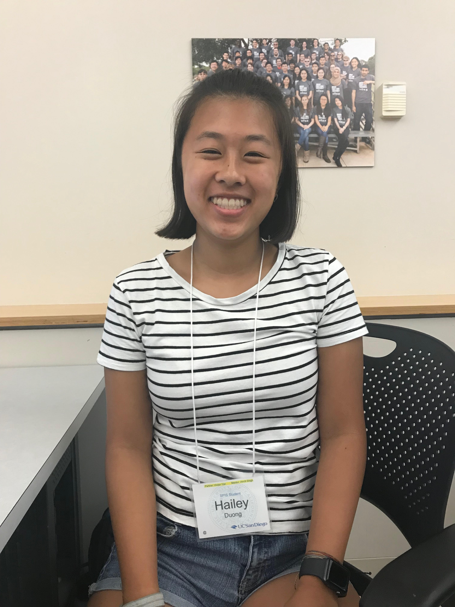

# practice-hailey-d
Hi, my name is Hailey Duong and I'm from LA County. Through SPIS, I hope to gain an understanding of CS so that I will be prepared for my future at UCSD. I'm also very excited to learn coding and using different languages like Python. During non-academic sessions, I love watching and reading up on the Marvel Cinematic Universe and listening to show tunes.

